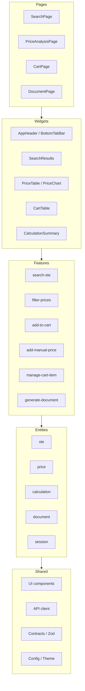
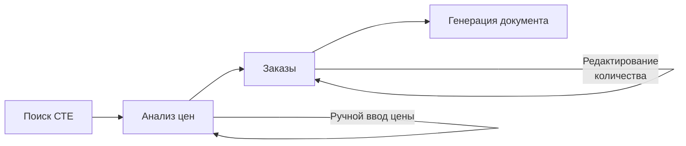

<div align="center">

[](https://react.dev)
[](https://ant.design)
[](#)
[](#cicd--deploy)


</div>

---

## Архитектура — Feature-Sliced Design



---

## Стек технологий

| Категория | Технология | Назначение |
|-----------|-----------|------------|
| UI-фреймворк | React 19 | Рендеринг, хуки |
| Типизация | TypeScript 5.9 | Строгая типизация |
| Сборка | Vite 8 | Dev-сервер, HMR, билд |
| UI-компоненты | Ant Design 6 | Таблицы, формы, layout |
| Серверное состояние | TanStack Query 5 | Кеширование, мутации |
| Клиентское состояние | Zustand 5 | Сессия, корзина |
| Валидация | Zod (contracts) | Runtime-валидация API |
| Графики | Recharts 3 | Визуализация цен |
| HTTP | Axios | Запросы к API |
| Роутинг | React Router 7 | SPA-навигация |
| PWA | vite-plugin-pwa | Офлайн, установка |
| Контейнер | Docker + nginx | Продакшн-деплой |

---

## Структура проекта (FSD)

```
src/
├── app/                    # Инициализация, роутер, провайдеры, глобальные стили
│   └── router/
├── pages/                  # Страницы приложения
│   ├── search/             # Поиск СТЕ
│   ├── price-analysis/     # Анализ цен
│   ├── cart/               # Корзина
│   ├── document/           # Генерация DOCX
│   └── not-found/
├── widgets/                # Составные UI-блоки
│   ├── header/             # Шапка / AppHeader
│   ├── bottom-tab-bar/     # Мобильная навигация
│   ├── search-results/     # Таблица результатов поиска
│   ├── price-table/        # Таблица + карточки цен
│   ├── price-chart/        # График цен (Recharts)
│   ├── cart-table/         # Таблица корзины
│   ├── calculation-summary/# Итог расчёта НМЦК
│   └── layout/             # Общий layout
├── features/               # Бизнес-действия
│   ├── search-ste/         # Поиск по СТЕ
│   ├── filter-prices/      # Фильтрация цен
│   ├── add-to-cart/        # Добавление в корзину
│   ├── add-manual-price/   # Ручной ввод цены
│   ├── manage-cart-item/   # Управление позициями
│   └── generate-document/  # Генерация DOCX
├── entities/               # Бизнес-сущности (типы, API, сторы)
│   ├── ste/
│   ├── price/
│   ├── calculation/
│   ├── document/
│   └── session/
└── shared/                 # Переиспользуемое ядро
    ├── ui/                 # Button, StatusTag, QuantityInput, ...
    ├── contracts/          # Zod-схемы для API
    ├── config/             # Тема, env-переменные
    ├── constants/
    └── lib/                # Утилиты (useIsMobile, ...)
```

---

## Пользовательский сценарий



---

## Ключевые возможности

- **Умный поиск СТЕ** — фильтры по категории и производителю, релевантное ранжирование
- **Анализ цен** — таблица + график, фильтрация по региону и периоду, детекция выбросов
- **Расчёт НМЦК** — средняя, медиана, коэффициент вариации, автоматическое обоснование
- **Корзина** — мультипозиционный расчёт, управление количеством
- **Генерация DOCX** — экспорт обоснования начальной цены в документ
- **PWA** — работает офлайн, устанавливается на мобильные устройства
- **Адаптивный UI** — десктоп-таблицы + мобильные карточки, bottom tab bar

---

## CI/CD & Deploy

```
Docker multi-stage build:
  node:22-alpine → npm ci → vite build → nginx:1.27-alpine
```

**Продакшн:** Docker-контейнер с nginx, порт 90.

---

## Быстрый старт

```bash
# Локальная разработка
npm ci --legacy-peer-deps
npm run dev

# Docker
docker build -t beers-bears --build-arg VITE_API_BASE_URL=/api .
docker run -p 90:90 beers-bears
```

| Переменная | По умолчанию | Описание |
|-----------|-------------|----------|
| `VITE_API_BASE_URL` | `/api` | Базовый URL backend-API |

---

<div align="center">

**BeersBears** · Tender Hack Пермь 2026

</div>
